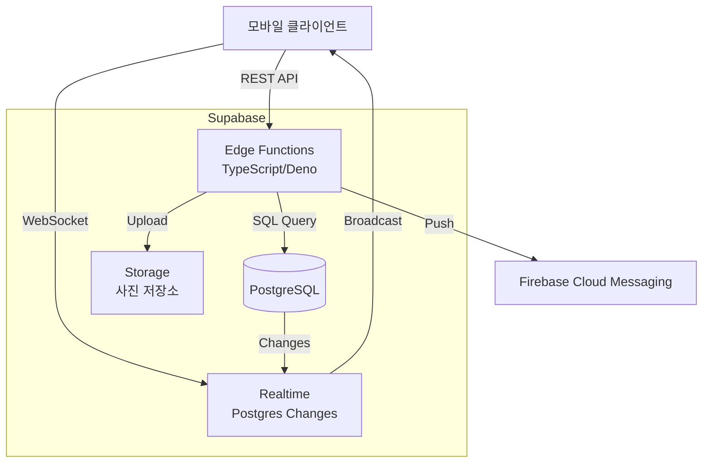
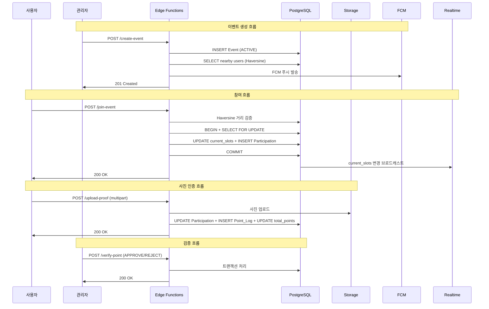
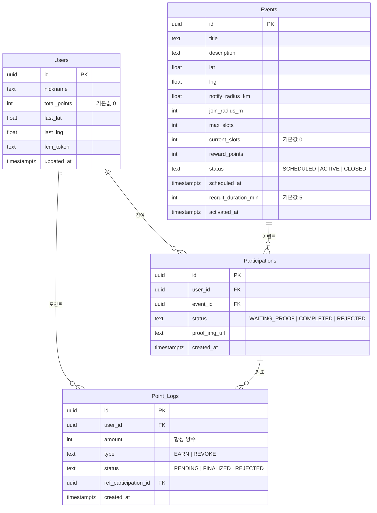

# Hi Spot 백엔드 설계 문서

## 개요 (Overview)

Hi Spot은 Supabase 기반의 위치 기반 이벤트 참여 시스템이다. 사용자는 실시간 위치를 기반으로 주변 이벤트에 참여하고, 사진 인증을 통해 포인트를 획득한다.

본 설계는 7개의 Supabase Edge Functions(TypeScript)와 PostgreSQL 데이터베이스 스키마를 다룬다. 핵심 설계 원칙은 다음과 같다:

- **Lazy Close**: pg_cron 없이 조회 시점에 만료 이벤트를 자동 마감
- **Haversine 공식**: PostGIS 없이 순수 SQL로 좌표 거리 계산
- **SELECT FOR UPDATE**: 선착순 참여의 동시성 제어
- **포인트 선지급 + 후검증**: 사진 업로드 시 즉시 포인트 지급, 관리자가 후에 승인/거절
- **인증 없음**: 해커톤 MVP 기준

## 아키텍처 (Architecture)

### 시스템 구성도



### API 엔드포인트 구조

| # | Edge Function 이름 | HTTP 메서드 | 경로 | 설명 |
|---|---|---|---|---|
| 1 | `update-location` | PATCH | `/update-location` | 유저 위치 업데이트 |
| 2 | `create-event` | POST | `/create-event` | 이벤트 생성 + FCM 알림 |
| 3 | `list-active-events` | GET | `/list-active-events` | ACTIVE 이벤트 목록 (Lazy Close) |
| 4 | `check-geofence` | POST | `/check-geofence` | 지오펜싱 검증 |
| 5 | `join-event` | POST | `/join-event` | 선착순 참여 |
| 6 | `upload-proof` | POST | `/upload-proof` | 사진 업로드 + 포인트 선지급 |
| 7 | `verify-point` | POST | `/verify-point` | 관리자 포인트 검증 |

### 요청 흐름




## 컴포넌트 및 인터페이스 (Components and Interfaces)

### 1. `update-location` — 유저 위치 업데이트

**요청:**
```typescript
// PATCH /update-location
interface UpdateLocationRequest {
  user_id: string;  // uuid
  lat: number;      // 위도
  lng: number;      // 경도
}
```

**응답:**
```typescript
// 200 OK
interface UpdateLocationResponse {
  success: true;
  updated_at: string; // ISO 8601
}

// 400 Bad Request — lat/lng 누락
// 404 Not Found — user_id 없음
```

**로직:**
1. `user_id`, `lat`, `lng` 필수값 검증
2. Users 테이블에서 해당 user_id 존재 확인
3. `last_lat`, `last_lng`, `updated_at = now()` 업데이트

---

### 2. `create-event` — 이벤트 생성 + FCM 알림

**요청:**
```typescript
// POST /create-event
interface CreateEventRequest {
  title: string;
  description?: string;
  lat: number;
  lng: number;
  notify_radius_km: number;
  join_radius_m: number;
  max_slots: number;
  reward_points: number;
  recruit_duration_min?: number; // 기본값 5
}
```

**응답:**
```typescript
// 201 Created
interface CreateEventResponse {
  event_id: string;
  notified_count: number; // FCM 발송 대상 수
}

// 400 Bad Request — 필수 필드 누락
```

**로직:**
1. 필수 필드 검증: `title`, `lat`, `lng`, `notify_radius_km`, `join_radius_m`, `max_slots`, `reward_points`
2. Events INSERT: `status = 'ACTIVE'`, `activated_at = now()`, `recruit_duration_min = 요청값 || 5`
3. Haversine 쿼리로 `notify_radius_km` 반경 + `updated_at > now() - interval '5 minutes'` 조건의 User 조회
4. 조회된 User의 `fcm_token`으로 FCM 일괄 발송
5. FCM 실패 시 로그 기록 후 계속 진행

**Haversine SQL (알림 대상 조회):**
```sql
SELECT id, fcm_token FROM users
WHERE fcm_token IS NOT NULL
  AND updated_at > now() - interval '5 minutes'
  AND (
    6371 * acos(
      cos(radians($lat)) * cos(radians(last_lat))
      * cos(radians(last_lng) - radians($lng))
      + sin(radians($lat)) * sin(radians(last_lat))
    )
  ) <= $notify_radius_km;
```

---

### 3. `list-active-events` — ACTIVE 이벤트 목록 조회

**요청:**
```typescript
// GET /list-active-events
// 파라미터 없음
```

**응답:**
```typescript
// 200 OK
interface ListActiveEventsResponse {
  events: Array<{
    id: string;
    title: string;
    description: string;
    lat: number;
    lng: number;
    join_radius_m: number;
    max_slots: number;
    current_slots: number;
    reward_points: number;
    recruit_duration_min: number;
    activated_at: string;
  }>;
}
```

**로직:**
1. **Lazy Close**: `status = 'ACTIVE'` AND `activated_at + recruit_duration_min * interval '1 minute' <= now()` 인 이벤트를 `CLOSED`로 UPDATE
2. `status = 'ACTIVE'`인 모든 이벤트 SELECT 후 반환
3. ACTIVE 이벤트가 없으면 빈 배열 반환

---

### 4. `check-geofence` — 지오펜싱 검증

**요청:**
```typescript
// POST /check-geofence
interface CheckGeofenceRequest {
  user_id: string;
  event_id: string;
  lat: number;
  lng: number;
}
```

**응답:**
```typescript
// 200 OK
interface CheckGeofenceResponse {
  within_radius: boolean;
  distance_m: number;
}

// 404 Not Found — event_id 없음
```

**로직:**
1. Events 테이블에서 `event_id`로 이벤트 조회 (없으면 404)
2. Haversine 공식으로 사용자 좌표 `(lat, lng)`와 이벤트 좌표 `(event.lat, event.lng)` 간 거리(m) 계산
3. `distance_m <= join_radius_m` 여부에 따라 `within_radius` 반환

**Haversine 거리 계산 (미터):**
```sql
SELECT (
  6371000 * acos(
    cos(radians($user_lat)) * cos(radians(e.lat))
    * cos(radians(e.lng) - radians($user_lng))
    + sin(radians($user_lat)) * sin(radians(e.lat))
  )
) AS distance_m
FROM events e WHERE e.id = $event_id;
```

---

### 5. `join-event` — 선착순 참여

**요청:**
```typescript
// POST /join-event
interface JoinEventRequest {
  user_id: string;
  event_id: string;
  lat: number;
  lng: number;
}
```

**응답:**
```typescript
// 200 OK
interface JoinEventResponse {
  participation_id: string;
  current_slots: number;
  max_slots: number;
}

// 400 Bad Request — ACTIVE가 아닌 이벤트
// 403 Forbidden — 지오펜스 밖
// 409 Conflict — 마감 또는 중복 참여
```

**로직:**
1. Events에서 `event_id` 조회, `status != 'ACTIVE'`이면 400
2. Haversine으로 지오펜싱 검증, 범위 밖이면 403
3. `(user_id, event_id)` 중복 체크, 이미 존재하면 409
4. **트랜잭션 시작:**
   ```sql
   BEGIN;
   SELECT current_slots, max_slots FROM events WHERE id = $event_id FOR UPDATE;
   -- current_slots >= max_slots 이면 ROLLBACK + 409
   UPDATE events SET current_slots = current_slots + 1 WHERE id = $event_id;
   -- current_slots + 1 == max_slots 이면 status = 'CLOSED'로도 UPDATE
   INSERT INTO participations (user_id, event_id, status) VALUES ($user_id, $event_id, 'WAITING_PROOF');
   COMMIT;
   ```
5. Supabase Realtime이 `events` 테이블 변경을 자동 브로드캐스트

---

### 6. `upload-proof` — 사진 업로드 + 포인트 선지급

**요청:**
```typescript
// POST /upload-proof
// Content-Type: multipart/form-data
interface UploadProofRequest {
  participation_id: string;
  file: File; // 사진 파일
}
```

**응답:**
```typescript
// 200 OK
interface UploadProofResponse {
  proof_img_url: string;
  points_earned: number;
  total_points: number;
}

// 400 Bad Request — WAITING_PROOF가 아닌 상태
// 404 Not Found — participation_id 없음
```

**로직:**
1. Participations에서 `participation_id` 조회 (없으면 404)
2. `status != 'WAITING_PROOF'`이면 400
3. Supabase Storage에 파일 업로드 → `proof_img_url` 획득
4. **트랜잭션:**
   ```sql
   BEGIN;
   UPDATE participations SET status = 'COMPLETED', proof_img_url = $url WHERE id = $participation_id;
   INSERT INTO point_logs (user_id, amount, type, status, ref_participation_id)
     VALUES ($user_id, $reward_points, 'EARN', 'PENDING', $participation_id);
   UPDATE users SET total_points = total_points + $reward_points WHERE id = $user_id;
   COMMIT;
   ```

---

### 7. `verify-point` — 관리자 포인트 검증

**요청:**
```typescript
// POST /verify-point
interface VerifyPointRequest {
  participation_id: string;
  action: 'APPROVE' | 'REJECT';
}
```

**응답:**
```typescript
// 200 OK
interface VerifyPointResponse {
  success: true;
  action: 'APPROVE' | 'REJECT';
}

// 400 Bad Request — 잘못된 action / Point_Log 없음
// 404 Not Found — participation_id 없음
// 409 Conflict — 이미 처리됨
```

**로직:**

**APPROVE:**
1. Participations에서 `participation_id` 조회 (없으면 404)
2. 해당 Participation의 EARN 타입 Point_Log 조회 (없으면 400)
3. Point_Log `status`가 `FINALIZED` 또는 `REJECTED`이면 409
4. Point_Log `status`를 `FINALIZED`로 UPDATE

**REJECT:**
1~3은 APPROVE와 동일
4. **단일 트랜잭션:**
   ```sql
   BEGIN;
   -- (a) 기존 Point_Log status → REJECTED
   UPDATE point_logs SET status = 'REJECTED' WHERE id = $point_log_id;
   -- (b) REVOKE Point_Log INSERT
   INSERT INTO point_logs (user_id, amount, type, status, ref_participation_id)
     VALUES ($user_id, $amount, 'REVOKE', 'FINALIZED', $participation_id);
   -- (c) total_points 차감
   UPDATE users SET total_points = total_points - $amount WHERE id = $user_id;
   COMMIT;
   ```
5. Participations `status`를 `REJECTED`로 UPDATE


## 데이터 모델 (Data Models)

### ER 다이어그램



### DDL (PostgreSQL)

```sql
-- Enum 타입 생성
CREATE TYPE event_status AS ENUM ('SCHEDULED', 'ACTIVE', 'CLOSED');
CREATE TYPE participation_status AS ENUM ('WAITING_PROOF', 'COMPLETED', 'REJECTED');
CREATE TYPE point_log_type AS ENUM ('EARN', 'REVOKE');
CREATE TYPE point_log_status AS ENUM ('PENDING', 'FINALIZED', 'REJECTED');

-- Users 테이블
CREATE TABLE users (
  id UUID PRIMARY KEY DEFAULT gen_random_uuid(),
  nickname TEXT NOT NULL,
  total_points INT NOT NULL DEFAULT 0,
  last_lat DOUBLE PRECISION,
  last_lng DOUBLE PRECISION,
  fcm_token TEXT,
  updated_at TIMESTAMPTZ DEFAULT now()
);

-- Events 테이블
CREATE TABLE events (
  id UUID PRIMARY KEY DEFAULT gen_random_uuid(),
  title TEXT NOT NULL,
  description TEXT,
  lat DOUBLE PRECISION NOT NULL,
  lng DOUBLE PRECISION NOT NULL,
  notify_radius_km DOUBLE PRECISION NOT NULL,
  join_radius_m INT NOT NULL,
  max_slots INT NOT NULL,
  current_slots INT NOT NULL DEFAULT 0,
  reward_points INT NOT NULL,
  status event_status NOT NULL DEFAULT 'ACTIVE',
  scheduled_at TIMESTAMPTZ,
  recruit_duration_min INT NOT NULL DEFAULT 5,
  activated_at TIMESTAMPTZ DEFAULT now()
);

-- Participations 테이블
CREATE TABLE participations (
  id UUID PRIMARY KEY DEFAULT gen_random_uuid(),
  user_id UUID NOT NULL REFERENCES users(id),
  event_id UUID NOT NULL REFERENCES events(id),
  status participation_status NOT NULL DEFAULT 'WAITING_PROOF',
  proof_img_url TEXT,
  created_at TIMESTAMPTZ DEFAULT now(),
  UNIQUE (user_id, event_id)
);

-- Point_Logs 테이블
CREATE TABLE point_logs (
  id UUID PRIMARY KEY DEFAULT gen_random_uuid(),
  user_id UUID NOT NULL REFERENCES users(id),
  amount INT NOT NULL CHECK (amount > 0),
  type point_log_type NOT NULL,
  status point_log_status NOT NULL DEFAULT 'PENDING',
  ref_participation_id UUID NOT NULL REFERENCES participations(id),
  created_at TIMESTAMPTZ DEFAULT now()
);

-- 인덱스
CREATE INDEX idx_events_status ON events(status);
CREATE INDEX idx_participations_user_event ON participations(user_id, event_id);
CREATE INDEX idx_point_logs_participation ON point_logs(ref_participation_id);
```

### Supabase Realtime 설정

Events 테이블의 `current_slots`와 `status` 변경을 클라이언트에 브로드캐스트하기 위해 Supabase Realtime의 Postgres Changes 기능을 활용한다.

```typescript
// 클라이언트 측 구독 예시
const channel = supabase
  .channel('events-changes')
  .on('postgres_changes', {
    event: 'UPDATE',
    schema: 'public',
    table: 'events',
    filter: `status=eq.ACTIVE`
  }, (payload) => {
    // current_slots, status 변경 반영
  })
  .subscribe();
```

### Supabase Storage 설정

사진 업로드를 위한 Storage 버킷:
- 버킷 이름: `proof-images`
- 파일 경로 패턴: `{event_id}/{participation_id}.{ext}`
- MVP에서는 파일 포맷/용량 제한 없음 (Supabase 기본 제한 사용)

### 설계 결정 사항

| 결정 | 선택 | 근거 |
|---|---|---|
| 거리 계산 | Haversine SQL | PostGIS 설치 불필요, MVP에 충분한 정확도 |
| 만료 처리 | Lazy Close | pg_cron 불필요, 조회 시점에 자동 처리 |
| 동시성 제어 | SELECT FOR UPDATE | PostgreSQL 네이티브, 추가 인프라 불필요 |
| 포인트 방식 | 선지급 + 후검증 | 사용자 즉시 보상 경험, 관리자 후 검증 |
| 인증 | 없음 | 해커톤 MVP, 빠른 개발 우선 |
| amount 부호 | 항상 양수 + type 구분 | 데이터 일관성, 쿼리 단순화 |
| Realtime | Postgres Changes | Supabase 내장 기능, 추가 설정 최소화 |


## 정확성 속성 (Correctness Properties)

*속성(Property)은 시스템의 모든 유효한 실행에서 참이어야 하는 특성 또는 동작이다. 속성은 사람이 읽을 수 있는 명세와 기계가 검증할 수 있는 정확성 보장 사이의 다리 역할을 한다.*

### Property 1: 위치 업데이트 round-trip

*For any* 유효한 사용자와 임의의 위도(-90~90), 경도(-180~180) 값에 대해, 위치 업데이트 API 호출 후 해당 사용자를 조회하면 `last_lat`과 `last_lng`가 요청한 값과 일치해야 한다.

**Validates: Requirements 2.1**

### Property 2: 이벤트 생성 시 ACTIVE 상태 보장

*For any* 유효한 이벤트 생성 요청에 대해, 생성된 이벤트의 `status`는 반드시 `ACTIVE`이고, `activated_at`은 null이 아닌 현재 시각 부근의 타임스탬프여야 한다.

**Validates: Requirements 3.1**

### Property 3: recruit_duration_min 기본값 처리

*For any* 이벤트 생성 요청에 대해, `recruit_duration_min`이 포함되면 해당 값이 저장되고, 미포함이면 기본값 5가 저장되어야 한다.

**Validates: Requirements 3.2**

### Property 4: Haversine 알림 대상 필터링

*For any* 이벤트 좌표와 `notify_radius_km`, 그리고 임의의 사용자 좌표 집합에 대해, FCM 알림 대상으로 선정된 모든 사용자는 (a) Haversine 거리가 `notify_radius_km` 이내이고 (b) `updated_at`이 5분 이내여야 한다. 반대로, 두 조건을 모두 만족하는 사용자는 반드시 대상에 포함되어야 한다.

**Validates: Requirements 3.3**

### Property 5: Lazy Close 만료 이벤트 자동 마감

*For any* ACTIVE 상태 이벤트 집합에 대해, `list-active-events` 호출 후 `activated_at + recruit_duration_min`이 현재 시각을 초과한 이벤트는 모두 `CLOSED` 상태로 변경되어야 하며, 반환 목록에 포함되지 않아야 한다.

**Validates: Requirements 4.1, 4.2, 4.3**

### Property 6: 지오펜싱 판정 일관성

*For any* 사용자 좌표 `(lat, lng)`와 이벤트 좌표 `(event.lat, event.lng)` 및 `join_radius_m`에 대해, Haversine 공식으로 계산된 `distance_m`이 `join_radius_m` 이하이면 `within_radius`는 `true`, 초과이면 `false`여야 한다.

**Validates: Requirements 5.1, 5.2, 5.3**

### Property 7: 선착순 참여 동시성 보장

*For any* ACTIVE 이벤트와 지오펜스 내 N명의 서로 다른 사용자가 동시에 참여 요청을 보내면, 성공한 참여 수 + 거절된 참여 수 = N이고, 성공한 참여 수 ≤ `max_slots`이며, 최종 `current_slots`는 성공한 참여 수와 일치해야 한다.

**Validates: Requirements 6.3**

### Property 8: 마지막 슬롯 자동 마감

*For any* ACTIVE 이벤트에서 `current_slots`가 `max_slots - 1`인 상태에서 참여가 성공하면, `current_slots`는 `max_slots`가 되고 `status`는 `CLOSED`로 변경되어야 한다.

**Validates: Requirements 6.5**

### Property 9: 참여 성공 시 올바른 레코드 생성

*For any* 지오펜스 내 사용자의 유효한 참여 요청에 대해, 참여 성공 후 Participations 테이블에 해당 `(user_id, event_id)` 조합의 레코드가 `status = 'WAITING_PROOF'`로 존재해야 한다.

**Validates: Requirements 6.1, 6.6**

### Property 10: 사진 업로드 트랜잭션 일관성

*For any* `WAITING_PROOF` 상태의 Participation에 대해, 사진 업로드 성공 후 (a) Participation `status`는 `COMPLETED`, (b) `proof_img_url`은 non-null, (c) Point_Logs에 `type=EARN`, `status=PENDING`, `amount=reward_points`인 레코드가 존재해야 한다.

**Validates: Requirements 7.2, 7.3**

### Property 11: 포인트 선지급 합산 정확성

*For any* 사용자의 초기 `total_points`와 이벤트의 `reward_points`에 대해, 사진 업로드 성공 후 해당 사용자의 `total_points`는 정확히 `초기값 + reward_points`여야 한다.

**Validates: Requirements 7.4**

### Property 12: APPROVE 시 Point_Log FINALIZED

*For any* `PENDING` 상태의 EARN 타입 Point_Log에 대해, APPROVE 처리 후 해당 Point_Log의 `status`는 `FINALIZED`여야 한다.

**Validates: Requirements 8.1**

### Property 13: REJECT 트랜잭션 원자성

*For any* `PENDING` 상태의 EARN 타입 Point_Log에 대해, REJECT 처리 후 (a) 기존 Point_Log `status`는 `REJECTED`, (b) `type=REVOKE`, `status=FINALIZED`, `amount=원래 포인트`인 새 Point_Log가 존재, (c) 사용자 `total_points`는 원래 포인트만큼 차감, (d) Participation `status`는 `REJECTED`여야 한다.

**Validates: Requirements 8.2, 8.3**


## 오류 처리 (Error Handling)

### HTTP 상태 코드 체계

| 상태 코드 | 의미 | 사용 상황 |
|---|---|---|
| 200 | OK | 정상 처리 |
| 201 | Created | 이벤트 생성 성공 |
| 400 | Bad Request | 필수 필드 누락, 잘못된 action, 잘못된 상태 |
| 403 | Forbidden | 지오펜스 밖에서 참여 시도 |
| 404 | Not Found | 존재하지 않는 리소스 |
| 409 | Conflict | 중복 참여, 마감된 이벤트, 이미 처리된 검증 |
| 500 | Internal Server Error | 예상치 못한 서버 오류 |

### 오류 응답 형식

```typescript
interface ErrorResponse {
  error: string;  // 오류 메시지 (한국어)
}
```

### API별 오류 처리

**update-location:**
- 400: `lat` 또는 `lng` 누락
- 404: 존재하지 않는 `user_id`

**create-event:**
- 400: 필수 필드 누락 (`title`, `lat`, `lng`, `notify_radius_km`, `join_radius_m`, `max_slots`, `reward_points`)
- FCM 실패: 로그 기록 후 정상 응답 (이벤트 생성은 성공)

**list-active-events:**
- 오류 없음 (빈 배열 반환 가능)

**check-geofence:**
- 404: 존재하지 않는 `event_id`

**join-event:**
- 400: ACTIVE가 아닌 이벤트 (`"참여할 수 없는 이벤트입니다"`)
- 403: 지오펜스 밖 (`"이벤트 반경 밖에 있습니다"`)
- 409: 마감 (`"참여 인원이 마감되었습니다"`) 또는 중복 (`"이미 참여한 이벤트입니다"`)

**upload-proof:**
- 400: WAITING_PROOF가 아닌 상태 (`"사진을 업로드할 수 없는 상태입니다"`)
- 404: 존재하지 않는 `participation_id`

**verify-point:**
- 400: 잘못된 `action` 값 또는 EARN Point_Log 없음 (`"검증할 포인트 기록이 없습니다"`)
- 404: 존재하지 않는 `participation_id`
- 409: 이미 처리됨 (`"이미 처리된 검증입니다"`)

### 트랜잭션 오류 처리

- `join-event`, `upload-proof`, `verify-point`의 트랜잭션 중 오류 발생 시 자동 ROLLBACK
- ROLLBACK 후 500 상태 코드와 일반 오류 메시지 반환
- 트랜잭션 오류는 서버 로그에 상세 기록

## 테스트 전략 (Testing Strategy)

### 이중 테스트 접근법

본 프로젝트는 단위 테스트와 속성 기반 테스트(Property-Based Testing)를 병행한다.

- **단위 테스트**: 특정 예시, 에지 케이스, 오류 조건 검증
- **속성 기반 테스트**: 모든 입력에 대한 보편적 속성 검증
- 두 방식은 상호 보완적이며, 함께 사용하여 포괄적 커버리지를 달성한다

### 속성 기반 테스트 설정

- **라이브러리**: [fast-check](https://github.com/dubzzz/fast-check) (TypeScript/JavaScript용 PBT 라이브러리)
- **테스트 프레임워크**: Deno 내장 테스트 러너 또는 Vitest
- **최소 반복 횟수**: 각 속성 테스트당 100회 이상
- **태그 형식**: `Feature: hanyang-go-backend, Property {number}: {property_text}`

### 단위 테스트 범위

단위 테스트는 다음에 집중한다:

1. **스키마 검증** (요구사항 1): 테이블 생성, 컬럼 타입, 제약조건 확인
2. **에지 케이스**: 존재하지 않는 리소스 404, 필수 필드 누락 400, 중복 참여 409 등
3. **FCM 통합**: mock을 사용한 FCM 발송 성공/실패 시나리오
4. **Storage 통합**: mock을 사용한 파일 업로드 시나리오

### 속성 기반 테스트 범위

각 정확성 속성(Property 1~13)에 대해 하나의 속성 기반 테스트를 작성한다:

| Property | 테스트 설명 | 생성기 |
|---|---|---|
| P1 | 위치 업데이트 round-trip | 임의 위도(-90~90), 경도(-180~180) |
| P2 | 이벤트 생성 ACTIVE 보장 | 임의 이벤트 데이터 |
| P3 | recruit_duration_min 기본값 | 임의 양의 정수 또는 undefined |
| P4 | Haversine 알림 대상 필터링 | 임의 좌표 쌍 + 반경 |
| P5 | Lazy Close 만료 처리 | 임의 이벤트 집합 (다양한 activated_at) |
| P6 | 지오펜싱 판정 일관성 | 임의 좌표 쌍 + join_radius_m |
| P7 | 선착순 동시성 보장 | 임의 N명 동시 참여 |
| P8 | 마지막 슬롯 자동 마감 | 임의 max_slots 값 |
| P9 | 참여 성공 레코드 생성 | 임의 user_id + event_id |
| P10 | 사진 업로드 트랜잭션 | 임의 participation + reward_points |
| P11 | 포인트 선지급 합산 | 임의 total_points + reward_points |
| P12 | APPROVE FINALIZED | 임의 PENDING Point_Log |
| P13 | REJECT 원자성 | 임의 PENDING Point_Log + amount |

### Haversine 공식 순수 함수 테스트

Haversine 거리 계산은 순수 함수로 추출하여 별도 테스트한다:

```typescript
function haversineDistance(
  lat1: number, lng1: number,
  lat2: number, lng2: number
): number; // 미터 단위 반환
```

속성 테스트:
- `haversineDistance(a, b, a, b) === 0` (동일 좌표 거리 = 0)
- `haversineDistance(a, b, c, d) === haversineDistance(c, d, a, b)` (대칭성)
- `haversineDistance(a, b, c, d) >= 0` (비음수)
